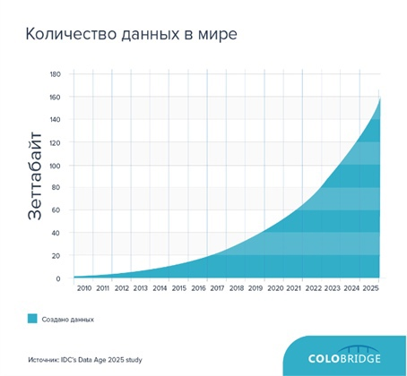
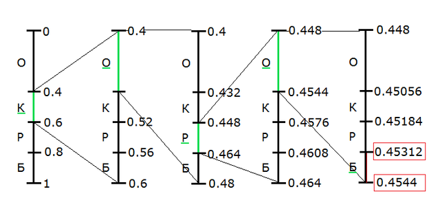
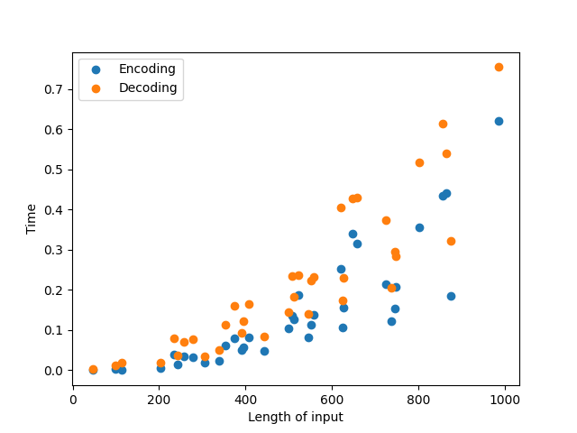
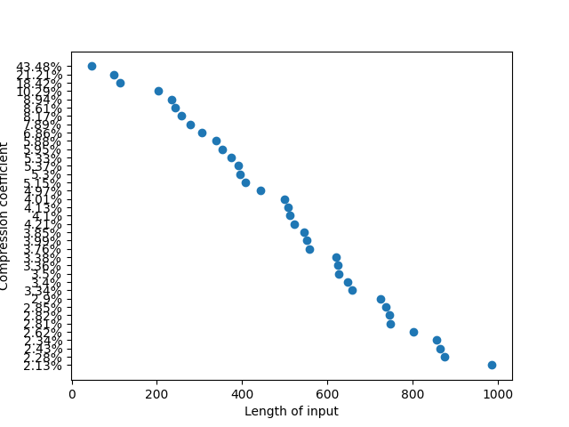

### МИНИСТЕРСТВО НАУКИ И ВЫСШЕГО ОБРАЗОВАНИЯ РОССИЙСКОЙ ФЕДЕРАЦИИ

### Федеральное государственное автономное образовательное учреждение высшего образования

## Дальневосточный федеральный университет
### ИНСТИТУТ МАТЕМАТИКИ И КОМПЬЮТЕРНЫХ ТЕХНОЛОГИЙ
### Департамент математического и компьютерного моделирования
### ДОКЛАД о практическом задании по дисциплине АИСД

# Арифмитическое сжатие

### Тонких Никита Сергеевич, гр. Б9121-09.03.03пикд

### г. Владивосток, 2022

# Арифмитическое сжатие

## Содержание

[*Содержание*](#содержание)

[*1. Введение*](#1-введение)

[*1.1 Применение*](#11-применение)

[*1.2 Глоссарий*](#12-глоссарий)

[*2. История*](#2-история)

[*2.1 Информационная катастрофа*](#21-информационная-катастрофа)

[*2.2 Арифметическое кодирование*](#22-арифметическое-кодирование)

[*2.3 Арифметическое декодирование*](#23-арифметическое-декодирование)

[*3. Формальное описание алгоритма*](#3-формальное-описание-алгоритма)

[*3.1 Алгоритм кодирования*](#31-алгоритм-кодирования)

[*3.2 Алгоритм декодирования*](#32-алгоритм-декодирования)

[*4. Реализация алгоритма*](#4-реализация-алгоритма)

[*4.1 Арифметическое кодирование*](#41-арифметическое-кодирование)

[*4.1.1 Создание алфавита*](#411-создание-алфавита)

[*4.2 Арифметическое декодирование*](#42-арифметическое-декодирование)

[*4.2.1 Создание сегментов*](#421-создание-сегментов)

[*4.2.2 Декодирование*](#422-декодирование)

[*5. Тестирование*](#5-тестирование)

[*6. Заключение*](#6-заключение)

[*7. Литература*](#7-литература)

# 1. Введение
Арифметическое кодирование — алгоритм сжатия информации без потерь, который при кодировании ставит в соответствие тексту вещественное число из отрезка [0;1). Данный метод, как и алгоритм Хаффмана, является энтропийным, то есть длина кода конкретного символа зависит от частоты встречаемости этого символа в тексте. Арифметическое кодирование показывает более высокие результаты сжатия, чем алгоритм Хаффмана, для данных с неравномерными распределениями вероятностей кодируемых символов.
## 1.1 Применение

Арифметическое кодирование применяется в сжатии данных, в том числе в сжатии изображений, аудио и видео. Также арифметическое кодирование используется в криптографии для шифрования данных.


## 1.2 Глоссарий

* Арифметическое кодирование — алгоритм сжатия информации без потерь, который при кодировании ставит в соответствие тексту вещественное число из отрезка [0;1).
* Арифметическое декодирование — процесс восстановления исходного текста из кодированного числа.
* Алфавит — множество уникальных символов, которые могут встречаться в тексте.
* Символ — элемент алфавита.
* Частота символа — количество вхождений символа в текст.
* Вероятность символа — отношение количества вхождений символа в текст к общему количеству символов в тексте.


# 2. История

## 2.1 Информационная катастрофа    
При наших темпах создания цифрового контента через 340 лет у нас будет $10\^{50}$ бит информации. Это количество битов представляет приблизительное количество атомов на Земле. Размер атома $10^{-10}$ $м\^{2}$, в то время как примерный размер бита информации $25\cdot10^{–9}$ $м\^{2}$. Даже если предположить, что технологический прогресс уменьшит размер бита до размера близких к атому, этот объем цифровой информации будет занимать больше, чем размер планеты.

<div>

</div>

*Рост количества данных*

Для решения этой проблемы можно использовать сжатие данных. Существует два типа сжатия данных:
* Неискажающие методы сжатия гарантируют, что закодированные данные будут полностью совпадать с исходными.
* Искажающие методы сжатия не гарантируют, что закодированные данные будут полностью совпадать с исходными.
Сжатие первого типа используется, когда нужно восстановить сжатые данные в первоначальном виде. Данный тип сжатия ничего не удаляет из исходных данных, само сжатие происходит за счёт более экономичного, представления данных. Второй же тип применяют, для видео файлов, изображений, звука. За счет потерь можно достигнуть более высокой степени сжатия. В этом случае потери при сжатии означают несущественное искажение изображения (звука) которые не препятствуют нормальному восприятию, но при сличении оригинала и восстановленной после сжатия копии могут быть замечены.

## 2.2 Алгоритмы сжатия

Без преувеличения можно сказать, что известны тысячи различных методов сжатия данных, однако многие из них заметно уступают другим по всем параметрам и поэтому не представляют интереса. Оставшиеся методы можно разбить на три больших класса.

1. Алгоритмы статического моделирования - это алгоритмы, которые предсказывают вероятность появления следующего символа на основе анализа частоты появления различных последовательностей символов в ранее закодированной части сообщения. Обладают очень низкой скоростью сжатия и требуют большого объема оперативной памяти. Скорость декодирования практически не отличается от скорости кодирования.
2. Алгоритмы словарного сжатия - это такие алгоритмы, которые заменяют подстроки кодируемой последовательности символов ссылками в словарь на идентичные подстроки. Обычно для ускорения поиска совпадающих подстрок и ограничения объема требуемой памяти область поиска ограничивается определенным количеством последних символов закодированной части.
3. Алгоритмы сжатия сортировкой блоков семейства BWT/BS, разработанные в 1994г. Барроузом и Уилером, разбивают кодируемую последовательность на блоки символов, представляют символы каждого блока так, что появляется много повторений одного и того же символа, а затем сжимают преобразованные данные каким-либо достаточно простым способом.

Как правило, вышеперечисленные методы сжатия применяются не самостоятельно, а в сочетании с каким-либо методом энтропийного кодирования, заменяющего символы их кодовыми словами – строками нулей и единиц – так, что более часто встречающимся символам соответствуют более короткие слова. Такие методы кодирования известны с конца 40-х гг. и хорошо изучены. Их можно разбить на два больших класса: префиксные (методы Хаффмана, Шеннона, Шеннона-Фано) и арифметические.

## 2.3 Арифметические коды
Арифметические коды не ставят явного соответствия между символами и кодовыми словами, они основаны на других принципах.
Качество арифметического кодирования лучше, чем у посимвольного префиксного кодирования, и близко к теоретическому минимуму и при малой мощности алфавита, и при очень неравномерном распределении вероятностей появления символов.
Арифметические коды обычно применяются в сочетании с методами статистического моделирования для кодирования символов в соответствии с предсказанными вероятностями.

Базовые алгоритмы арифметического кодирования независимо разработали Йорма Дж. Риссанен из IBM Research и Ричард К. Паско. Оба алгоритма были опубликованы в мае 1976 года. Менее чем через год после публикации IBM подала заявку на патент США на работу Риссанена. Работа Паско не была запатентована.

Основной принцип арифметического кодирования состоит в том, чтобы представить закодированное сообщение как интервал между действительными числами 0 и 1 Чем длиннее сообщение, тем меньше интервал для кода для его представления и тем больше двоичных битов требуется для представления этого интервала.

# 3. Формальное описание алгоритма

## 3.1 Арифметическое кодирование

Начальные данные:

* `s` - исходная строка;
* `n` - длина строки;
* `m` - количество различных символов в строке;
* `letters[m]` - массив символов строки;
* `frequencies[m]` - массив частот символов;
* `Segment` - структура, которая описывает отрезок на координатной прямой, где:
    * `left` - левая граница отрезка;
    * `right` - правая граница отрезка;

1. Рассмотрим отрезок [0;1) на координатной прямой.
2. Поставим каждому уникальному символу текста в соответствие отрезок с длиной равной частоте встречаемости этого символа.
3. Берём символ из исходной строки и рассмотрим отрезок, который соответствует этому символу. Снова выполним шаг (2), считая, что текущая левая граница отрезка равна 0, а правая — 1.
4. Повторим пункт (3) до конца исходной строки.
5. Возьмём любое число, которое лежит в получившемся отрезке. Это число и будет закодированным текстом.

<div>

</div>

*Принцип арифметического сжатия*

## 3.2 Арифметическое декодирование

Начальные данные:

* `code` - закодированная строка;
* `n` - длина строки;
* `m` - количество различных символов в строке;
* `letters[m]` - массив символов строки;
* `frequencies[m]` - массив частот символов;
* `Segment` - структура, которая описывает отрезок на координатной прямой, где;
    * `left` - левая граница отрезка
    * `right` - правая граница отрезка
    * `character` - символ, соответствующий отрезку

1. Выберем на отрезке [0;1), разделенном на сегменты, у которых длины равны вероятностям появления символа в тексте, тот подотрезок, что содержащит закодированную строка. Символ, который соответствует этому подотрезку, добавляем к отрезку.
2. Нормируем подотрезок и вещественное число.
3. Повторим пункты (1) и (2) до получения ответа.

# 4. Реализация алгоритма

## 4.1 Арифметическое кодирование

``` python
class Encoder:
    class Segment:
        def __init__(self, left, right):
            self.left = left
            self.right = right

    def __init__(self, text):        
        self.alphabet = []
        self.m = 0
        self.frequencies = {}
        self.segments = {}
        self.text = text
        self.n = len(text)
```

Класс состоит из следующих полей:
* `alphabet` - список букв текста;
* `m` - длина алфавита;
* `frequencies` - ассоциативный массив вида: буква - частота символа;
* `Segment` - класс, который хранит отрезок для каждой буквы алфавита;
* `text` - исходный текст;
* `n` - длина текста.

### 4.1.1 Создание алфавита

``` python
def create_alphabet(self): 
    for symbol in self.text:
        if symbol not in self.alphabet:
            self.alphabet.append(symbol)
    self.m = len(self.alphabet)
```

В этой функции мы добавляем в алфавит все буквы текста, если их там нет. После этого считаем длину алфавита.

### 4.1.2 Создание частот

``` python
def create_frequencies(self):
    number_of_chars = dict(Counter(self.text))
    for k, v in number_of_chars.items():
        self.frequencies[k] = Fraction(number_of_chars[k], self.n)
```

Для каждой буквы текста мы считаем количество ее вхождений в текст и делим на длину текста. Получаем вероятность символа. Также здесь используется класс Counter из библиотеки collections, который считает количество вхождений каждого символа в текст и класс Fraction из библиотеки fractions, который позволяет работать с дробями, чтобы избежать ошибок при работе с числами с плавающей точкой.

### 4.1.3 Создание сегментов

``` python
def define_segments(self):    
    l = Fraction()
    for symbol in self.alphabet:
        r = l + self.frequencies[symbol]
        self.segments[symbol] = self.Segment(l, r)
        l = r
```

Для каждого символа алфавита мы считаем отрезок, в который он попадает. Для этого мы считаем сумму вероятностей всех символов, которые идут до текущего в алфавите. Это и будет левая граница отрезка. Правая граница отрезка - это сумма левой границы и вероятности текущего символа.

### 4.1.4 Кодирование

``` python
def encode(self):
    l = Fraction()
    r = Fraction(1)
    for symbol in self.text:
        l = l + (r - l) * self.segments[symbol].left
        r = l + (r - l) * self.segments[symbol].right
    return l
```

Для каждого символа текста мы считаем новые границы отрезка, в который он попадает. Для этого мы считаем сумму левой и правой границы отрезка, в который попадает текущий символ, умноженную на длину отрезка. Это и будет новая левая граница. Новая правая граница - это сумма левой и правой границы отрезка, в который попадает текущий символ, умноженная на длину отрезка.

## 4.2 Декодирование

``` python
class Decoder:
    class Segment:
        def __init__(self, left, right, symbol):
            self.left = left
            self.right = right
            self.symbol = symbol

    def __init__(self, code, n, m, alphabet, frequencies):
        self.code = code
        self.n = n
        self.m = m
        self.alphabet = alphabet
        self.frequencies = frequencies
        self.segments = {}
```

Класс декодера состоит из следующих полей:

  * `code` - код, который необходимо декодировать;
  * `n` - количество символов в тексте;
  * `m` - количество символов в алфавите;
  * `alphabet` - алфавит;
  * `frequencies` - вероятности символов алфавита;
  * `segments` - отрезки, в которые попадают символы алфавита.

### 4.2.1 Создание сегментов

``` python
def define_segments(self):
    l = Fraction()
    for symbol in self.alphabet:
        r = l + self.frequencies[symbol]
        self.segments[symbol] = self.Segment(l, r, symbol)
        l = r
```
Сегменты создаются также, как и при кодировании, только мы ещё и храним символ, который попадает в этот отрезок.

### 4.2.2 Декодирование

``` python
def decode(self):
    text = ''
    for i in range(self.n):
        for symbol in self.alphabet:
            if self.segments[symbol].left <= self.code < self.segments[symbol].right:
                text += symbol
                self.code = (self.code - self.segments[symbol].left) / (self.segments[symbol].right - self.segments[symbol].left)
                break
    return text
```


# 5. Тестирование
## Входные данные
Строка, в которой от 1 до 1000 символов. 

## Выходные данные
При успешном выполнении теста в консоль выводится строка "Тест n пройден", где n - номер теста. В противном случае выводится строка "Тест n не пройден. Введено: text. Получено: result", где n - номер теста, text - исходный текст, result - результат декодирования.

В файл output.txt записывается закодированная строка.
В файл result.txt записывается декодированная строка, результат теста, время работы кодирования и декодирования, процент сжатия.

## Время работы

<div>

</div>

*Зависимость времени работы от длинны строки*

## Процент сжатия

<div>

</div>

*Зависимость степени сжатия от длины строки*

# 6. Заключение

В результате проведённой работы удалось:

* Изучить материалы по арифметическому сжатию данных 
* Разработать программу, реализующую алгоритм кодирования и декодирования текста с помощью арифметического сжатия данных
* Протестировать программу на различных входных данных

# 7. Список литературы

1. https://neerc.ifmo.ru/wiki/index.php?title=Арифметическое_кодирование
2. https://habr.com/ru/post/130531/
3. https://techinsider-ru.turbopages.org/techinsider.ru/s/editorial/701413-skolko-informacii-my-proizvodim-ezhegodno-i-gde-ona-hranitsya/
4. https://ieeexplore.ieee.org/document/5386860
5. https://www.comsol.ru/blogs/who-discovered-the-integrated-circuit/
6. https://theconversation.com/the-worlds-data-explained-how-much-were-producing-and-where-its-all-stored-159964
7. https://aip.scitation.org/doi/10.1063/5.0019941
8. https://habr.com/ru/company/selectel/blog/562962/
9. https://mf.grsu.by/UchProc/livak/po/comprsite/theory_classification_01.html
10. https://mai.ru/upload/iblock/f41/statisticheskiy-algoritm-szhatiya-informatsii.pdf
11. http://cotty.16x16.com/compress/peppm.htm
12. https://habr.com/ru/post/132683/
13. https://towardsdatascience.com/how-data-compression-works-exploring-lz77-3a2c2e06c097
14. https://neerc.ifmo.ru/wiki/index.php?title=Преобразование_Барроуза-Уилера
15. https://www.geeksforgeeks.org/burrows-wheeler-data-transform-algorithm/
16. https://habr.com/ru/company/playrix/blog/441814/
17. https://findpatent.ru/patent/237/2379832.html
18. https://studfile.net/preview/5240128/page:2/
19. https://intuit.ru/studies/courses/3481/723/lecture/14228?page=4
20. https://habr.com/ru/post/130531/
21. https://algolist.manual.ru/compress/standard/arithm.php
22. https://habr.com/ru/post/570694/
23. https://wikipredia.net/ru/Arithmetic_coding#History_and_patents
24. https://russianblogs.com/article/8595747620/
25. https://studopedia.ru/5_131543_arifmeticheskoe-kodirovanie.html
26. https://ru.wikipedia.org/wiki/Интервальное_кодирование
27. https://web.stanford.edu/class/ee398a/handouts/papers/WittenACM87ArithmCoding.pdf


 


